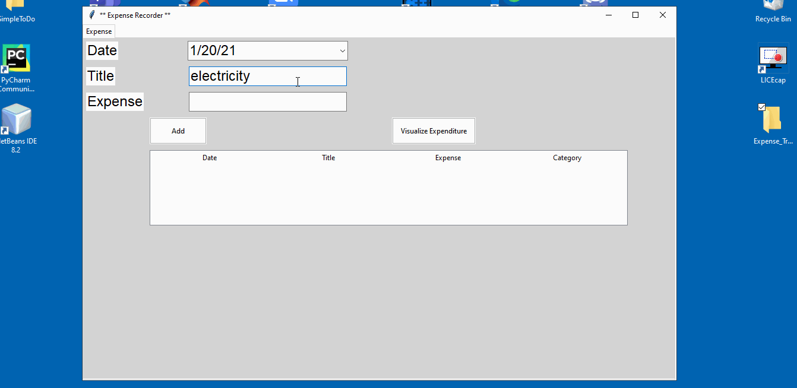

# Expense Tracker

Expense Tracker is a software that classifies lists of monthly items into necessities and luxury goods, and displays them in an interactive Graphical User Interface,
including a graph that shows how much a user spends money on essential and non-essential items on a monthly basis.

# Functionalities

Users can:
* [x] Add an item with the associated cost
* [x] Create a list of items within a same month
* [x] Check the associated category (through Item Classifier) of each item
* [x] Look at the graph of each monthly expenditure, split into necessities and luxury goods
* [x] See which specific category they are spending most money on (Ex: Luxury goods--entertainment, Necessities--education)
  
# Demonstration

GIF created with [LiceCap](http://www.cockos.com/licecap/).

